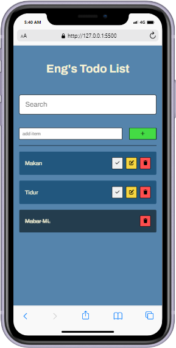
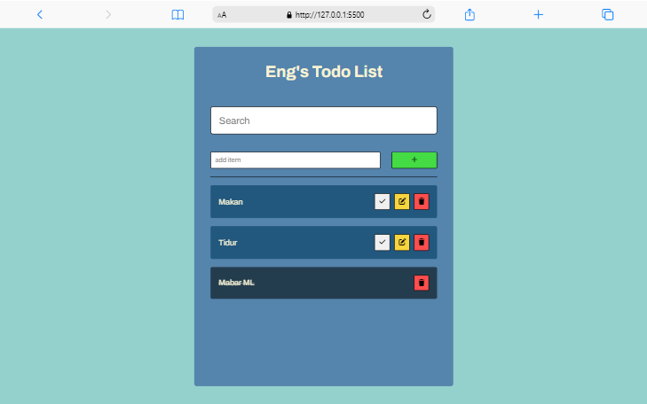

# Tugas 3 PemWeb 2022

## Eng's Todo List

### Stack

1. HTML
2. CSS (Vanilla)
3. Javascript (Vanilla)

### Fitur

1. Menambahkan todo
2. Menghapus todo
3. Mengubah todo
4. Menandai todo selesai
5. Mempertahankan todo setelah refresh
6. Live search todo

### Screenshot

